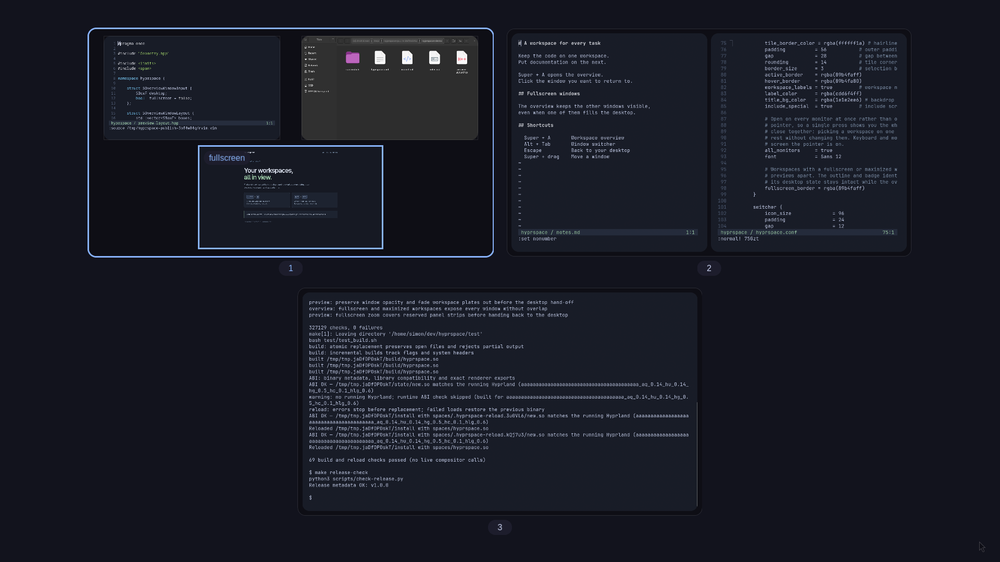
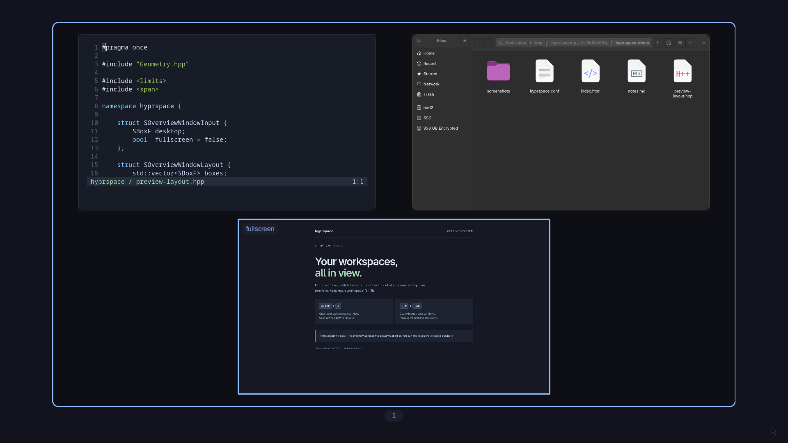
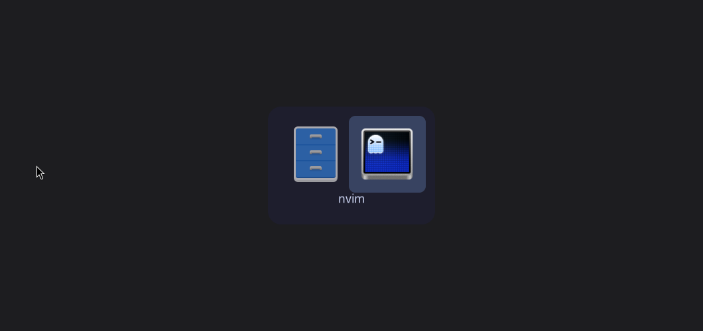

# hyprspace

A live workspace overview and an Alt+Tab switcher for Hyprland.

Press **Super + A** to see your workspaces and pick a window. Fullscreen and
maximized workspaces spread their previews apart so every window stays visible.
Hold **Alt + Tab** to cycle windows, then release Alt to focus your selection.

The interactive overview keeps running while you launch applications, rearrange
windows across monitors, resize and use normal Hyprland bindings. Walker result
targeting uses the [companion integration](companion/README.md). The development
implementation has nested and physical three-monitor coverage; see the
[verification record](docs/verification/2026-09-06.md) for the tested builds and
limits. These changes remain unreleased.



Tested with **Hyprland 0.56.2** on Arch Linux and Omarchy. The plugin uses
Hyprland's internal APIs and must be built against your compositor's exact
commit and library ABI. Rebuild it after updating Hyprland.

## Install

These instructions use `hyprland.conf` syntax, as used by the tested Omarchy
setup. See the [reference](docs/guide.md) for all options and controls.

Install the build dependencies on Arch Linux:

```bash
sudo pacman -S --needed hyprland base-devel git cairo pango gdk-pixbuf2 librsvg libei jq
```

If a system update installed a newer Hyprland, log into that version before
building and loading the plugin.

### Build locally

```bash
git clone https://github.com/simonwinther/hyprspace.git ~/dev/hyprspace
cd ~/dev/hyprspace
make
make install
```

`make install` checks the build's ABI and installs it to
`~/.local/share/hyprspace/hyprspace.so`. It prints these lines with your actual
paths. Add them at the end of `~/.config/hypr/hyprland.conf`:

```ini
plugin = /home/YOU/.local/share/hyprspace/hyprspace.so
source = ~/dev/hyprspace/contrib/hyprspace.conf
```

The plugin path must be absolute. Keep the source line after your other bindings
so the included Alt+Tab bindings take effect. Then run:

```bash
hyprctl reload
hyprctl configerrors
```

To build and activate a later change, run `make reload` from the checkout.
Builds and installs replace files atomically; copying over a loaded `.so`
directly can crash the compositor.

### Use hyprpm

Install hyprpm's additional build tools and register the repository:

```bash
sudo pacman -S --needed cmake cpio
hyprpm add https://github.com/simonwinther/hyprspace.git
hyprpm enable hyprspace
hyprpm reload
```

Add this to the end of `~/.config/hypr/hyprland.conf`:

```ini
exec-once = hyprpm reload
unbind = ALT, TAB
unbind = ALT SHIFT, TAB
bind = SUPER, A, hyprspace:overview
bind = ALT, TAB, hyprspace:switch
bind = ALT SHIFT, TAB, hyprspace:switch, prev
```

Run `hyprctl reload` to apply the bindings. Hyprpm manages the plugin path;
use this setup on its own instead of also loading a local build. Run
`hyprpm update` and `hyprpm reload` after a Hyprland update. The upstream
[plugin guide](https://wiki.hypr.land/Plugins/Using-Plugins/) covers hyprpm setup.

For launch contexts with hyprpm, also run `make install-assets` from a checkout
of the matching revision and follow the [companion guide](companion/README.md).
The plugin finds those helpers in `~/.local/share/hyprspace` when they are not
beside the hyprpm-managed library.

## Use it

| Control | Action |
|---|---|
| Super + A | Open or close the workspace overview |
| Click a preview | Focus that window |
| Arrows or Tab, then Enter | Select and open a workspace |
| 1 through 9, or 0 | Open workspace 1 through 10 |
| Super + left drag | Rearrange a window or move it across workspaces and outputs |
| Super + right drag | Resize a window in its preview |
| Super + L | Cycle dwindle/scrolling on the indicated workspace |
| Alt + Tab / Alt + Shift + Tab | Cycle windows forward / backward |
| Release Alt | Focus the selected window |
| Escape | Dismiss either overlay without selecting |

The overview opens on all monitors by default, with each showing its own
workspaces. Alt+Tab stays on the current workspace unless you change
`switcher:current_workspace_only`.



Fullscreen and maximized windows keep their desktop state while you browse the
overview. Their badges show which windows are using those modes.



The screenshots are real captures from an isolated Hyprland session using demo
content. See [capture details](docs/screenshots/README.md).

## Configuration and development

- [Controls, configuration and known limitations](docs/guide.md)
- [Interactive session, launch contexts and verification](docs/interactive.md)
- [Example Hyprland configuration](contrib/hyprspace.conf)
- [Build checks and contributing](CONTRIBUTING.md)
- [Release process](docs/releasing.md) and [changelog](CHANGELOG.md)

Source releases are the supported distribution format. A prebuilt plugin from
another system can have an incompatible ABI even when its Hyprland version
number matches yours.

## License

[MIT](LICENSE). [NOTICE.md](NOTICE.md) records the ideas taken from hyprview and
hyprshell and preserves their attribution.
