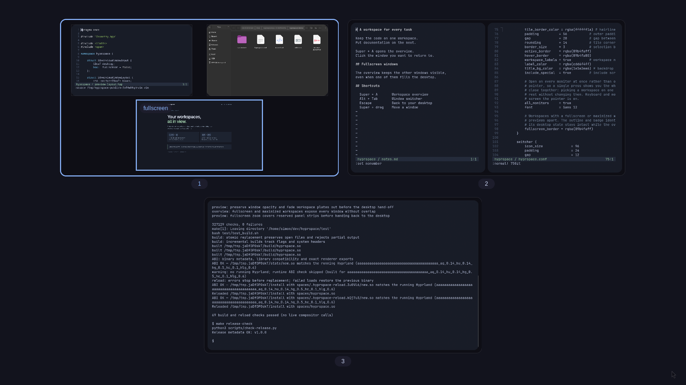
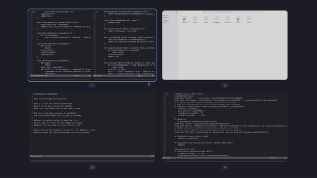
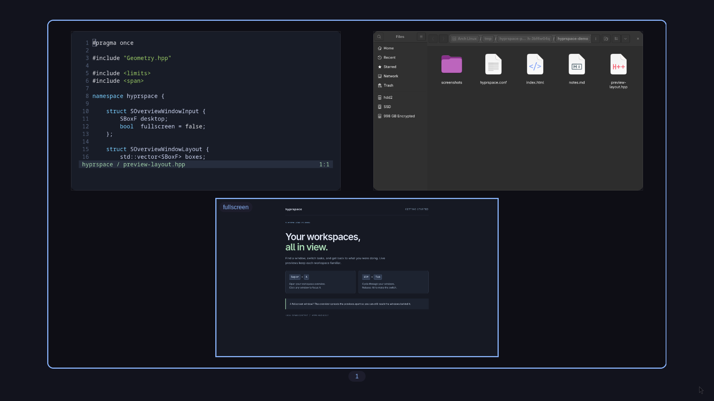
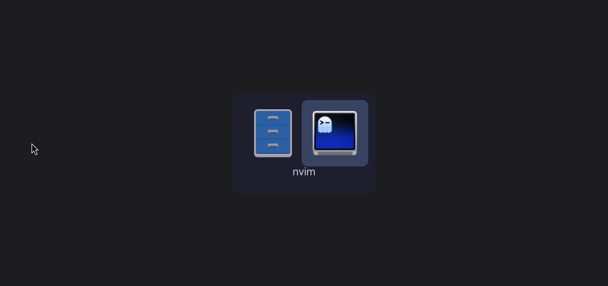

# hyprspace

A live workspace overview and an Alt+Tab switcher for Hyprland.

Supports **Hyprland 0.56.2**, commit
`efb50993780079460b0cbed1363e2166a2de1d9f`, on x86_64 Linux. The plugin must match
your compositor's commit and library ABI. Other Hyprland versions require
separate compatibility testing.

## Install

Use **hyprpm** on Arch and other Linux setups with the supported Hyprland build,
or the **tagged flake** on Nix. [Published releases](https://github.com/simonwinther/hyprspace/releases)
are the stable-version list. The commands below select `v1.5.0`. An unversioned
repository install tracks development.

### Arch Linux and hyprpm

On a system running the supported Hyprland version, install the dependencies
and select the release explicitly:

```bash
sudo pacman -S --needed hyprland base-devel git cmake cpio cairo pango gdk-pixbuf2 librsvg libei nlohmann-json jq python
hyprpm update
hyprpm add https://github.com/simonwinther/hyprspace.git v1.5.0
hyprpm enable hyprspace
hyprpm reload
```

Check that your package repositories still provide the supported compositor
before installing. Avoid partial system upgrades. On other distributions,
install the equivalent development packages, then use the same hyprpm commands.

Add this after your other bindings in `~/.config/hypr/hyprland.conf`:

```ini
exec-once = hyprpm reload
unbind = SUPER, A
unbind = ALT, TAB
unbind = ALT SHIFT, TAB
bind = SUPER, A, hyprspace:overview
bind = ALT, TAB, hyprspace:switch
bind = ALT SHIFT, TAB, hyprspace:switch, prev
```

Apply the bindings and check activation:

```bash
hyprctl reload
hyprctl plugin list
hyprctl configerrors
```

The plugin list should include `hyprspace` and configuration errors should be
empty. Startup loading takes effect at your next login. Use hyprpm to manage
loading throughout; remove any local-build `plugin =` line when switching to it.

A selected tag stays selected during `hyprpm update`. To choose a newer published
release, remove and add the repository with that release's tag, then enable and
reload it. A Hyprland update still needs matching headers and a compatible
plugin release. See [updates, removal and troubleshooting](docs/install.md).

### NixOS and Home Manager

Add these inputs to your system flake:

```nix
inputs.hyprland.url = "github:hyprwm/Hyprland/efb50993780079460b0cbed1363e2166a2de1d9f";
inputs.hyprspace.url = "github:simonwinther/hyprspace/v1.5.0";
inputs.hyprspace.inputs.hyprland.follows = "hyprland";
```

In Home Manager, with `inputs` passed through `extraSpecialArgs`:

```nix
{ inputs, ... }:
let
  plugin = inputs.hyprspace.packages.x86_64-linux.hyprspace;
  compositor = plugin.compositor;
in {
  wayland.windowManager.hyprland = {
    enable = true;
    package = compositor;
    plugins = [ plugin ];
    extraConfig = "source = ${plugin}/share/hyprspace/bindings.conf";
  };
}
```

Home Manager loads the plugin at startup and the packaged bindings use its
defaults. Select that same `compositor` for the NixOS session. The
[Nix guide](docs/nix.md) shows the complete wiring and validation status.
Use this repository's flake: Nixpkgs' `hyprlandPlugins.hyprspace` is a different
project.

## Overview

Press **Super + A** to see your workspaces and pick a window. Fullscreen and
maximized workspaces spread their previews apart so every window stays visible.
Hold **Alt + Tab** to cycle windows, then release Alt to focus your selection.

The overview stays open while you launch applications, rearrange windows,
resize and use normal Hyprland bindings. Walker targeting uses the optional
[companion integration](companion/README.md). See the
[verification record](docs/verification/2026-09-06.md) for tested builds and limits.



## Use it

| Control | Action |
|---|---|
| Super + A | Open the overview; press again to open the selected workspace |
| Click a preview | Focus that window |
| Arrows or Tab / Shift+Tab, then Enter or S | Select and open a workspace |
| N or + Empty workspace | Select an empty workspace on the monitor under the pointer |
| Middle-click | Select an empty workspace on that monitor and keep the overview open |
| Hold Z | Fit the selected workspace; release to return to the grid |
| Wheel / vertical two-finger scroll while holding Z | Zoom around the pointer; scroll back to the fitted view |
| + / − while holding Z | Zoom around the center; hold to repeat (`=` and keypad + / − also work) |
| Space + touchpad motion while holding Z and magnified | Grab and pan the view |
| Shift + arrows while holding Z and magnified | Pan toward that direction; hold to repeat |
| Right drag while holding Z and magnified | Pan the view with grab/grabbing cursor feedback |
| 1 through 9, or 0 | Open workspace 1 through 10 |
| Super + left drag | Rearrange a window or move it across workspaces and outputs |
| Super + right drag | Resize a window in its preview |
| Super + Alt + left drag | Move a workspace to another monitor |
| Super + L (optional binding) | Cycle dwindle/scrolling on the indicated workspace |
| Alt + Tab / Alt + Shift + Tab | Cycle windows forward / backward |
| Release Alt | Focus the selected window |
| Escape | Dismiss either overlay without selecting |

The overview opens on all monitors by default, with each showing its own
workspaces. Alt+Tab uses the active normal workspace on the monitor under the
pointer. Setting `switcher:current_workspace_only = false` includes windows
across all workspaces and monitors.

Hold **Super + Alt** and left-drag anywhere inside a regular workspace tile,
including over its window previews, then drop anywhere in another monitor's
overview. The workspace keeps its number, name and layout. The overview stays
open and selects the moved tile, which glides into its new slot on release;
the destination keeps its current desktop workspace. Scratchpads cannot be
dragged this way, and pinned windows stay on the source monitor. Escape cancels
the drag. Drops on the source monitor,
panels, monitor gaps or outputs without an overview leave placement unchanged.
Set `overview:workspace_drag_modifiers` to customize the exact modifiers, or
leave it empty to disable workspace dragging.

Inside the overview, **middle-click**, press **N** or click **+ Empty workspace**
to prepare a destination on the monitor under the pointer. Hyprspace reuses an
empty workspace there before creating another. The overview stays open and
highlights the tile: launch an application, drag a window into it, or press Enter
to open it. The pointer stays where it is and workspace tiles stay in numeric
order. You can also Super-drag a window directly onto the button. Preparing a destination leaves
the desktop unchanged until you commit an action, so Escape still dismisses it.
Change `overview:empty_workspace_key` to another XKB key name, or use an empty
value to disable the shortcut. If it matches `overview:zoom_key`, zoom keeps that
key and the empty-workspace shortcut is disabled.

On a small screen, hold **Z** to smoothly enlarge one workspace. While holding
it, use arrows or Tab/Shift+Tab to browse that monitor's workspaces, or hover
briefly at an edge to slide to its neighbor. Edge hints show the available
directions, including above and below. Press **S** or Enter to open the selected
workspace while holding Z. Releasing Z smoothly restores the grid.
While holding Z, use vertical two-finger scrolling or the wheel to inspect the
area under the pointer. On a laptop, hold Space and move one finger to pan, or
use Shift+arrows. For keyboard-only inspection, use + / − to zoom around the
center, then Shift+arrows to pan. Held zoom and pan keys repeat at your configured
keyboard rate. Right-click and drag also pans; the hand cursor closes during a
grab. Scroll down to return to the fitted workspace; zoom stops there and at four times that
size. Release Z at any point to return to the grid. A monitor with one workspace
already shows the fitted view, so Z alone keeps that framing.

Press Super+A again to zoom directly into the current selection, including after
hovering another workspace. Escape dismisses the overview without selecting.



[Watch the full-resolution video](docs/screenshots/zoom-pan.mp4).

Change `overview:zoom_key` to another XKB key name, or leave it empty to disable
this control.

In a scrolling workspace, use the wheel or two-finger scrolling to pan its preview.
Edge arrows reveal hidden columns. Page Up/Page Down select columns and Enter
opens the selection; Tab/Shift+Tab still move between workspaces.



Fullscreen and maximized windows keep their desktop state while you browse the
overview. Their badges show which windows are using those modes.



The screenshots are real captures from an isolated Hyprland session using demo
content. See [capture details](docs/screenshots/README.md).

## Configuration and development

- [Controls, configuration and known limitations](docs/guide.md)
- [Interactive session, launch contexts and verification](docs/interactive.md)
- [Example Hyprland configuration](contrib/hyprspace.conf)
- [Build checks and contributing](CONTRIBUTING.md)
- [Release process](docs/releasing.md) and [changelog](CHANGELOG.md)

Source releases are the supported distribution format. A prebuilt plugin from
another system can have an incompatible ABI even when its Hyprland version
number matches yours.

## License

[MIT](LICENSE). [NOTICE.md](NOTICE.md) records the ideas taken from hyprview and
hyprshell and preserves their attribution.
