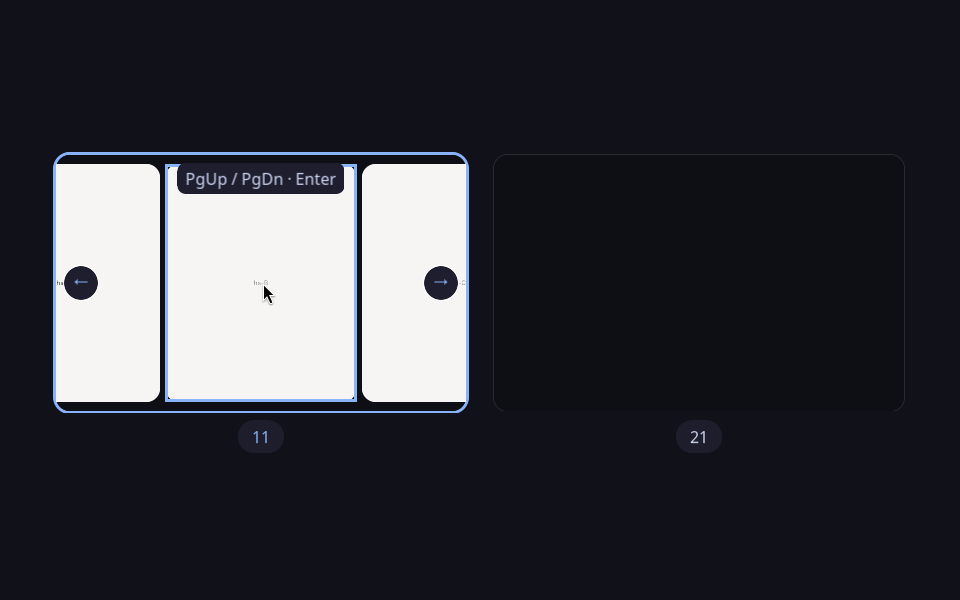

# Configuration and reference

[Back to the README](../README.md)

## Build and update options

`BUILD_DIR=/some/build/path make` puts build output in a separate directory.
`PREFIX=/some/where make install` changes the installation prefix, and
`PLUGIN_DIR=/some/directory make install` sets the plugin directory directly.
Use the same variables when running `make reload` or `make uninstall`.

Builds track compiler flags, dependency versions and system headers. A Hyprland
update therefore triggers recompilation without a manual clean. `make install`
checks the embedded ABI against the running session. With no active session it
skips the runtime check with a warning; the plugin checks its ABI when loaded.
An unreachable session that is expected to be running stops installation.

`make reload` stages and checks the new binary, unloads the old plugin, then
replaces and loads it. A failed unload stops the operation. If loading fails
and no plugin remains registered, the script restores the previous installed
binary and reloads it only if its ABI can be verified. Concurrent reloads are
rejected. These checks do not make arbitrary plugin runtime changes crash free.

`make install` leaves an already loaded plugin running its existing code until
the next login or explicit reload. `hyprctl reload` rereads configuration but
does not replace a plugin that is already in memory.

## Keybindings

### Hyprland

```ini
# The plugin path must be absolute; Hyprland does not expand `~` here.
plugin = /home/YOU/.local/share/hyprspace/hyprspace.so

bind = SUPER, A, hyprspace:overview
bind = ALT, TAB, hyprspace:switch
bind = ALT SHIFT, TAB, hyprspace:switch, prev
```

`SUPER + A` is the default because it is free on a stock Omarchy and, unlike
`GRAVE`, it is in the same place on every keyboard layout. On a Danish layout
the key above Tab is `½`, so a `GRAVE` binding simply never fires. If you would
rather tap Super on its own, uncomment the `bindr` line in
[`contrib/hyprspace.conf`](../contrib/hyprspace.conf); `bindr` fires on key release, so Super held as a
modifier for another shortcut will not open the overview.

### Omarchy

Omarchy keeps `ALT+SHIFT+Tab` on `changegroupactive`, and an `unbind` in your own
`bindings.conf` will not stick if Omarchy's defaults are sourced after it.
[`contrib/hyprspace.conf`](../contrib/hyprspace.conf) therefore does the unbinds itself:

```ini
unbind = ALT, TAB
unbind = ALT SHIFT, TAB
```

so it only needs to be sourced **after** every other bindings file. Put the two
lines at the very end of `~/.config/hypr/hyprland.conf`:

```ini
plugin = /home/YOU/.local/share/hyprspace/hyprspace.so
source = ~/dev/hyprspace/contrib/hyprspace.conf
```

Never edit the files under `~/.local/share/omarchy/`; they are replaced on
update.

### Dispatchers

| Dispatcher | Argument | Effect |
|---|---|---|
| `hyprspace:overview` | *(none)* | Toggle the overview on every monitor |
| `hyprspace:overview` | `on` | Open, never toggle closed |
| `hyprspace:overview` | `off` | Close if open |
| `hyprspace:switch` | *(none)* / `next` | Open the switcher, or step forward |
| `hyprspace:switch` | `prev` / `backward` | Open the switcher, or step backward |
| `hyprspace:close` | *(none)* | Dismiss whichever overlay is up, without selecting |

`hyprspace:close` works over the hyprctl socket even while an overlay holds the
keyboard grab, which makes it a reliable escape hatch.

### Controls

**Overview**

| Key | Action |
|---|---|
| `Esc` | Close, keep the current workspace |
| `Enter` / `Space` | Switch to the selected workspace and close |
| `Tab` / `Shift+Tab` | Next / previous workspace |
| `←` `↓` `↑` `→` | Move to the nearest tile in that direction |
| `h/j/k/l` | Same, vim style |
| `1` through `9`, `0` | Go to that workspace at once, no Enter needed (`0` = workspace 10) |
| `Home` / `End` | First / last tile |
| `Page Up` / `Page Down` | Previous / next column in a scrolling workspace; Enter opens the selection |
| Mouse move | Hover highlights, and selects when `follow_mouse` is on |
| Left click | Go there. Clicking a *window* inside a tile focuses that window; clicking empty space dismisses |
| Right click | Close without selecting |
| `Super` + drag left | Rearrange a window or move it to any workspace tile on any output |
| `Super` + drag right | Resize that window in place, scaled into the tile |
| Wheel / two-finger scroll | Pan the scrolling workspace under the pointer; other layouts step the workspace selection |
| Edge arrows inside a scrolling tile | Reveal the next hidden column and keep the overview open |

Scrolling previews accept horizontal and vertical wheel/trackpad input. Wheel
detents move a quarter viewport and high-resolution detents retain their fraction;
touchpad movement is continuous. Native scroll factors and each workspace's layout
direction apply. Edge arrows appear only where columns extend beyond the preview.
Page Up moves left/up and Page Down moves right/down, including reversed layouts.
Tab and Shift+Tab still select workspaces. Clicking a window always focuses it
and closes the overview, including a partially visible window.



Screenshot, volume, brightness and media keys are passed through to the system
while either overlay is up. When `Print` opens an interactive screenshot picker,
hyprspace temporarily yields its input grab and draws underneath that picker;
after the capture or cancellation it resumes automatically. The captured image
still contains the overview or switcher. While the switcher has Alt held,
`Alt+Print` deliberately invokes the configured *plain* `Print` binding instead;
on Omarchy this takes a screenshot rather than opening its screen-recorder menu.

The overview binding toggles: pressing it again closes. Unmodified navigation
and Shift+Tab belong to the overview. Other keys run through Hyprland's native
binding matcher with the indicated window or workspace established first.
Ctrl/Super combinations, repeat/release bindings, submaps and keyboard-specific
binding settings retain their native matching behavior. Unbound keys and
application modifier events are suppressed while the overview owns input.
Super+L uses `hyprspace:layoutcycle`
from the example configuration to select dwindle or scrolling synchronously.
Launching, moving, resizing and changing layouts keep the overview open.

Overview resizing stays on the source workspace. Floating windows stop at its
usable edges, accounting for panels, decorations and application size limits.
Resize previews stay inside the tile even during the opening animation. Releasing
over a gap or another monitor finishes the resize in place; Escape cancels it.

Walker and other foreground layers retain keyboard focus while pointer movement
outside their input regions updates the overview target. See the
[interactive overview and companion integration](interactive.md) for launch
correlation, compatibility and verification details.

When a workspace has a fullscreen or maximized window and other windows, its
previews spread into separate rows inside the tile. Every preview keeps its
aspect ratio and remains individually clickable. The enlarged window has an
outline and a "fullscreen" or "maximized" badge; a workspace with just that
window uses the whole tile. Workspaces without an enlarged window retain their
desktop arrangement.

Opening the overview changes only the previews' positions. Escape returns to
the original desktop, and clicking the fullscreen preview keeps it fullscreen.
Clicking another preview follows Hyprland's fullscreen focus behavior: it can
transfer fullscreen to that window or reveal it at its normal size. If the focus
policy would redirect the click back to the covering window, the overview exits
that window's fullscreen mode and focuses the clicked window.

During the zoom, every preview on the opening or closing workspace moves between
its overview position and its actual desktop bounds. Fullscreen clipping follows
the same animation, including the area reserved by panels. Hover outlines, clicks
and drag pickup use the displayed bounds, and resizing uses the picked-up
preview's scale. Valid drops run Hyprland's native drag lifecycle, including its
fullscreen transitions and layout-specific placement rules. Escape cancels a
provisional drag; releasing between tiles cancels the move.

Workspace 10's tile is labelled **0**, because `0` is the key that goes there,
both here and in Hyprland's own `workspace` binds.

**Switcher**

| Key | Action |
|---|---|
| Hold `Alt`, tap `Tab` | Step forward through most-recently-used order |
| `Alt+Shift+Tab` | Step backward |
| Release `Alt` | Commit |
| `Esc` | Cancel, keep the current focus |
| `Enter` | Commit without waiting for the Alt release |
| `W` (while holding `Alt`) | Close the selected window without focusing it; keep switching |
| `Print` (while holding `Alt`) | Run the plain `Print` screenshot binding, not the system `Alt+Print` action |
| `←` / `→` | Step backward / forward |
| `↑` / `↓` | Move to the nearest icon in the row above / below |
| `Home` / `End` | Select the first / last window |
| `Page Up` / `Page Down` | Move backward / forward by one page |
| Mouse move, click | Hover selects when `follow_mouse` is on; click commits the pointed-at window |
| Scroll wheel | Step through the list |

Other unbound keys are swallowed while the switcher owns input.

When stepping tiles or switcher entries, high-resolution wheels accumulate
partial detents before moving the selection; touchpad and continuous scrolling
advance in controlled steps. Each overlay
keeps its own scroll state, and a new gesture starts without leftover movement.

Large switcher lists stay within the screen and show a small page counter when
needed. Tab and the arrow keys keep the selection visible across pages. The
panel keeps its width while live window titles change, so icons stay put under
the pointer.

Decoded icons are reused between openings, up to 128 icons and 16 MiB of pixel
buffers in memory. Configuration reloads and plugin unloads discard that cache.
GPU textures are still released when the last overlay closes, and icons on
other switcher pages are only uploaded when shown.

---

## Configuration

All options live under `plugin:hyprspace:` and can be set in a nested block or
with flat keys. Colours take Hyprland's usual `rgba()`/`rgb()` syntax; sizes are
in logical pixels and are scaled for HiDPI outputs automatically.

```ini
plugin {
    hyprspace {
        follow_mouse = true
        warp_cursor  = true

        overview {
            bg_dim  = 0.80
            padding = 56
        }

        switcher {
            icon_size = 96
        }
    }
}
```

### Shared

| Option | Type | Default | Meaning |
|---|---|---|---|
| `follow_mouse` | bool | `true` | Hovering a tile selects it |
| `warp_cursor` | bool | `true` | Warp the pointer onto the chosen window when committing |

`warp_cursor` matters more than it looks. With Hyprland's `input:follow_mouse`
enabled (the default, and Omarchy's), focusing a window while the pointer sits
over a different one means the pointer wins the moment the overlay closes, and
your selection silently does nothing. Warping is how Hyprland's own
`cyclenext` dispatcher solves this. Turn it off only if you also run
`input:follow_mouse = 0`.

### Overview

| Option | Type | Default | Meaning |
|---|---|---|---|
| `overview:bg_dim` | float `0..1` | `0.80` | How strongly the desktop behind is dimmed |
| `overview:bg_color` | color | `rgba(11111bff)` | Colour mixed over the desktop |
| `overview:tile_bg_color` | color | `rgba(0d0d14d9)` | Plate drawn behind each workspace tile |
| `overview:tile_border_color` | color | `rgba(ffffff1a)` | Hairline around every tile |
| `overview:padding` | int | `56` | Outer padding |
| `overview:gap` | int | `28` | Gap between workspace tiles |
| `overview:rounding` | int | `14` | Tile corner radius |
| `overview:border_size` | int | `3` | Selection border thickness |
| `overview:active_border` | color | `rgba(89b4faff)` | Selected tile border |
| `overview:hover_border` | color | `rgba(89b4fa80)` | Hovered tile border |
| `overview:workspace_labels` | bool | `true` | Workspace name under each tile |
| `overview:label_color` | color | `rgba(cdd6f4ff)` | Label colour |
| `overview:title_bg_color` | color | `rgba(1e1e2ee6)` | Backdrop behind that label |
| `overview:include_special` | bool | `true` | Include special/scratchpad workspaces |
| `overview:all_monitors` | bool | `true` | Open on every monitor at once rather than only the one under the pointer |
| `overview:font` | string | `Sans 12` | Pango font description |

Empty active workspaces and configured persistent workspaces are included.

#### Multiple monitors

By default one press covers the whole desktop: every monitor enters the
overview together, each tiling its own workspaces, and they leave together too.
Picking a workspace on one screen dismisses the others without changing what
they were showing. A monitor with nothing on it still dims, because one screen
left bright next to the others reads as a bug rather than as emptiness.

One session owns all views and the active drag. A drag preview follows the
pointer across outputs, including their offsets, scale and rotation. The source
and destination use workspace identities and weak window references. Tile
positions stay fixed during the drag while window membership is reconciled.
The last valid target is retained over gaps and foreground UI for commands;
gaps never become valid drop destinations. Keyboard focus navigation updates
the selected window until the pointer moves again.

Committing always acts on the monitor you picked from, not on the one Hyprland
still calls focused. That distinction matters here: the overview holds the
input grab, so moving the pointer to another screen does not move focus with
it, and the ordinary current-monitor workspace actions would switch the wrong
display.

Set `overview:all_monitors = false` for the older behaviour of one screen at a
time. Each monitor then toggles on its own and the others are left alone, so
you can still fill every screen by pressing the binding once per monitor.

### Switcher

| Option | Type | Default | Meaning |
|---|---|---|---|
| `switcher:icon_size` | int | `96` | App icon size |
| `switcher:padding` | int | `24` | Panel inner padding |
| `switcher:gap` | int | `12` | Gap between entries |
| `switcher:rounding` | int | `20` | Panel corner radius |
| `switcher:bg_color` | color | `rgba(1e1e2ef0)` | Panel background |
| `switcher:highlight_color` | color | `rgba(89b4fa40)` | Selection highlight |
| `switcher:text_color` | color | `rgba(cdd6f4ff)` | Title colour |
| `switcher:show_title` | bool | `true` | Show the selected window's title |
| `switcher:current_workspace_only` | bool | `true` | Restrict to the active workspace; a workspace with one window has nowhere to switch to. Set `false` to cycle every window on the monitor |
| `switcher:font` | string | `Sans 13` | Pango font description |

### Animations

The transitions reuse Hyprland's own animation curves rather than inventing
their own timing, so they match the rest of your desktop:

* overview open/close → `windowsMove`
* switcher fade → `fadeIn`

Retune those in your `animations` block to change the feel.

---

## How it works

```
              ┌── Event::bus() input.keyboard.key (cancellable, pre-keybind)
              │   input.mouse.move / .button
   Hyprland ──┤
              │   render.pre        → capture live window textures
              └── render.stage      → POST_WINDOWS: add the overlay pass element
```

* **Live tiles.** On every frame, each visible window is rendered into its own
  offscreen framebuffer with Hyprland's own window renderer in *standalone*
  mode: full alpha, no decorations, and it renders windows that
  sit on hidden workspaces too. Those clients are also un-suspended while the
  overview is up, so they keep producing frames instead of showing a stale one.
  When drawing those captures, the overview reapplies each window's resolved
  opacity and blur policy. Tiled windows reuse Hyprland's cached wallpaper blur
  when its optimizations allow it; floating windows follow its live-blur path.
  Blur-disabled windows stay unblurred. The tile backing fades away during the
  closing zoom, and the destination workspace stays visible through the hand-off.
* **Hiding the real windows.** Rather than painting over the desktop, the
  overview warps every collected window to zero alpha, which makes Hyprland's
  normal pass skip them. The session records and restores each window's previous
  fade alpha once, even if it transfers between outputs. Foreground layer surfaces
  and the compositor cursor render after the overview.
* **Drawing.** Panels and labels use ordinary texture, border and rect pass
  elements. Window previews advertise their blur requirements to Hyprland's
  render pass and use its existing OpenGL texture/blur compositor without custom
  shaders. If blur resources are unavailable, previews retain their opacity and
  draw without blur. Plugin-owned pass elements are removed before unloading.
* **Layout.** One tile per populated, active or persistent workspace, every tile shaped like the
  monitor's *usable* area (the output minus whatever the bar reserved). Mapping
  the full output instead would leave an empty strip along the top of every
  tile where the bar sits, which is the single most obvious way to make this
  look wrong. Each window is drawn at its real relative position, except on
  fullscreen or maximized workspaces, where separate preview slots keep windows
  from covering one another. Drawing and pointer hit testing share the same
  animated bounds. Column counts for workspace tiles are all tried and the one
  producing the largest cell wins, so the grid stays close to square: 5
  workspaces become 3 over 2, a single workspace fills the screen, and 10 still
  come out readable. The trailing row is centred rather than left-aligned.
* **The opening transition.** The workspace you are already on starts at full
  screen and shrinks into its cell while the others fade up in place, so the
  desktop appears to fold into the grid rather than being replaced by it.
* **Icons.** Window class → `.desktop` entry → icon name → icon theme file, with
  Chromium/Edge web-app classes (`chrome-chatgpt.com__-Default`) decoded to their
  underlying site, which is how Omarchy's web apps report themselves. SVG goes
  through librsvg, everything else through gdk-pixbuf. Unresolvable apps get a
  tinted rounded square with their initial rather than a blank slot. Desktop and
  icon-theme discovery runs on a worker and builds one filename index, so the
  first switcher frame never recursively scans the filesystem.

Two load-order details worth knowing if you build on this: Hyprland parses the
config *before* it finishes loading plugins, so `bind = ..., hyprspace:overview`
in that same config is rejected as an invalid dispatcher; the plugin calls
`HyprlandAPI::reloadConfig()` at the end of `pluginInit` so the second pass
registers the bindings. And a plugin is never initialised twice, so that cannot
loop.

One deliberate implementation note: hyprspace needs `IHyprRenderer::renderWindow`,
which is `protected`. It reaches it with the standard-blessed explicit-instantiation
idiom ([temp.spec]/6) rather than the widespread `#define private public` hack,
which is undefined behaviour and, as of GCC 16's libstdc++, no longer even
compiles. See `src/Access.hpp`.

---

## Tests and build checks

```bash
make            # build the plugin
make check      # verify the built .so matches the running Hyprland's ABI
make test       # host-side unit tests and isolated build/reload checks
make -C test asan   # same suite under AddressSanitizer + UBSan
make clean
```

`make test` builds the Hyprland-independent parts (the layout and navigation
maths, `.desktop` parsing, window-class resolution and the cairo/pango
rasteriser) and runs them on the host, no compositor required. It covers aspect
uniform monitor-shaped cells at every workspace count from 1 to 10, the grid
staying inside the padded screen at four landscape display widths and a 1080x1920
portrait display, cells never overlapping, the expected grid shapes (1 fills the
screen, 5 becomes 3 over 2, the last row centred), directional navigation
including edges and out-of-range input, pointer
hit testing, localised/malformed `.desktop` files, Chromium web-app class
decoding, icon size and format preference, text ellipsising and SVG/PNG icon
loading. Mouse-button tests cover opening, closing and yielding an overlay
between press and release, so client drags do not get stuck and dismissing
clicks do not leak their releases to applications.

Additional host tests cover high-resolution wheel detents, smooth scrolling,
direction changes and gesture boundaries; switcher page bounds and selection
visibility on landscape, portrait and small outputs; vertical navigation through
partial rows; and decoded-icon cache eviction and pixel-buffer validation.
Preview tests cover compositor-opacity application, opaque rules, both animation
endpoints, destination-workspace visibility and continuous backing-plate fades.
Fullscreen preview layout tests cover mixed window proportions, one to 32
windows, separate clickable bounds, portrait outputs, tiny tiles and stable
columns during resizing. Animation tests check fullscreen clipping across panel
reservations and the visibility of windows obscured on the desktop.

Build/reload tests use small ELF fixtures and a simulated `hyprctl`, with no
commands sent to the desktop session. They cover atomic replacement with an old
file still open, failed links, incremental builds, changed compiler flags and
system headers, missing ABI metadata, commit and library mismatches, renderer
symbol checks, failed unloads and restoring a previous binary after load errors.

`make check` reads the `.hyprspace.abi` ELF section without loading the plugin,
compares it to the ABI reported by `hyprctl -j version`, and checks imported
renderer symbols against the executable of that running session. The plugin
also re-checks the full ABI string at load time and refuses to initialise on a
mismatch, with a notification telling you to rebuild. Binaries predating the
embedded ABI record must be rebuilt before installation.

The nested integration runner compares every directed pair of three outputs
(including same-workspace drops) against native gestures in dwindle, scrolling
and master. It also exercises foreground input, cursor rendering, asynchronous
launches, exact XDG surface correlation, rules, lock and unload. The runner creates
its own compositor, input devices, application fixtures, config and D-Bus session.
It never loads the development plugin into the host compositor. Test artifacts
include logs, screenshots and JSON results in the printed temporary directory.
Audit regressions cover protocol-level key/modifier isolation, IME handoff,
overlapping bottom panels and popups, launch destinations after output removal,
and visibility when a window leaves a single-monitor overview. Scrolling checks
cover all four directions, wheel and finger input, bounds, arrows, keyboard
selection, inactive workspaces, foreground typing and animated pointer targeting.

[Verification instructions and release gates](interactive.md#verification)
describe the automated and physical suites. The
[dated verification record](verification/2026-09-06-audit-fixes.md) records the tested builds,
results and limits.

---

## Cleanup and uninstall

```bash
cd ~/dev/hyprspace

# Unload from the running session (no restart needed)
hyprctl plugin unload ~/.local/share/hyprspace/hyprspace.so

# Remove the installed plugin
make uninstall

# Remove build artefacts
make clean
```

Then delete the configuration you added:

* the `source = .../hyprspace.conf` line, or the `plugin = ...`, `bind` and
  `bindr` lines, from `~/.config/hypr/hyprland.conf` / `bindings.conf`
* any `plugin { hyprspace { ... } }` block

and `hyprctl reload`.

If you installed with hyprpm instead:

```bash
hyprpm disable hyprspace
hyprpm remove hyprspace
```

Finally, remove the checkout: `rm -rf ~/dev/hyprspace`.

The launch interface creates a private socket in this compositor's runtime
directory and removes it on unload. Launch contexts live only in memory. Window
fade alpha and cursor ownership are restored when the overview closes and on
unload. Workspace and window actions use ordinary compositor state; layout-cycle
changes are dynamic and follow Hyprland's normal config reload behavior.

---

## Known limitations

* **The plugin ABI is tied to the exact Hyprland commit.** Every Hyprland
  update requires `make && make install` (or `hyprpm update`). The plugin
  refuses to load on a mismatch rather than crashing your session, so the
  failure mode is "Super does nothing", not a lost session. Built against
  **0.56.2**; earlier and later releases may need source changes, since the
  render, config and event APIs all moved in the 0.55 cycle. For the same
  reason, hyprview and hyprshell's Hyprland-facing code could not be reused
  directly; see [NOTICE.md](../NOTICE.md) for what was taken from each.
* **Compatibility is limited to the tested compositor and companion versions.**
  Nested tests cover portrait rotation and fractional scaling; physical tests
  cover the three-output setup with hardware and software cursors. Other GPU,
  compositor and launcher versions need their own validation.
* **Windows on hidden workspaces show their last frame briefly.** They are
  un-suspended when the overview opens, but a client needs a frame or two to
  redraw, so the first moments can show stale content for those tiles.
* **The grid is sized for up to about ten workspaces.** That is the practical
  ceiling on Omarchy and the layout is tested at every count from 1 to 10; beyond
  that the tiles keep shrinking rather than paginating.
* **`.desktop` and icon-theme discovery happens once per plugin load.** It starts
  asynchronously as the plugin loads; if Alt+Tab wins that race, lightweight
  initial-letter placeholders are shown and replaced when discovery completes.
  Apps installed while the session is running are picked up after a plugin reload.
* **Windows with no resolvable icon get an initial-letter placeholder.** This is
  common for terminals launched with an unusual class and for Electron apps that
  do not set `StartupWMClass`.
* **Uncorrelated launches retain native placement.** If a reused process discards
  activation information, hyprspace does not infer a destination from its app ID,
  PID alone or the next window to appear. Walker result targeting requires the
  [pinned companion patches](../companion/README.md).
* **The switcher's ordering comes from Hyprland's window history**, so a
  freshly-started session where nothing has been focused yet falls back to
  compositor window order rather than true most-recently-used.
* **No swipe-to-open gestures.** Two-finger scrolling can navigate an open
  overlay, but it cannot open one.
* **No animation on the switcher's selection movement**; the highlight jumps
  between entries rather than sliding.
